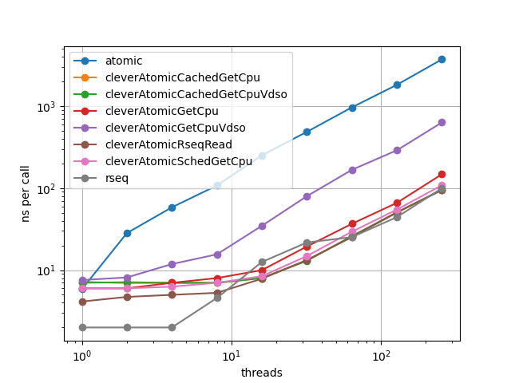

# Introduction

A mutex that uses restartable sequences in Linux to attempt to lock access to a given cpu.
This has the benefit that it has no atomics. The downside is that it only supports algorithms that do not need global 
mutual exclusion.

Note you cannot actually guarantee that you can lock this mutex. 
The lock may fail if it was taken by some sleeping or rescheduled thread, even though you are now running on that cpu.
In general I expect the critical section to be short, so we optimistically assume you will not be rescheduled while inside the critical section, 
and thus generally the lock will succeed. 

# API

`int rseq_mutex_static_init()`
Attempts to init the library. Return non-zero on fail. Will fail if running on too old a glibc or kernel. 
Undefined behaviour for the rest of the API on failure.

`int rseq_mutex_init(struct rseq_mutex** mutex);`
`struct rseq_mutex* rseq_mutex_create();`
`void rseq_mutex_free(struct rseq_mutex* mutex);`

Create and free a mutex.

`int rseq_mutex_try_lock(struct rseq_mutex* mutex)` 
Try and lock a mutex. Returns the cpu id that you have locked, which is the one the thread is scheduled on.
If returns < 0, then the lock was unsuccesful.

`rseq_mutex_release(struct rseq_mutex* mutex, int cpu);`
Release the lock.

`rseq_mutex_spin_lock_cpu(struct rseq_mutex* mutex, int cpu)`
Try and lock a given cpu (ie not specifically the current one).
This will spin until the target cpu is available.

`rseq_mutex_spin_unlock_cpu(struct rseq_mutex* mutex, int cpu)`
Unlock a cpu after having called `rseq_mutex_spin_lock_cpu`.i

# Benchmark

A simple benchmark is to test the performance of incrementing shared counters. An example use case for this 
is performance metrics.
For comparison I copied some algorithms used by 
[Facebook's Folly library](https://github.com/facebook/folly/blob/main/folly/concurrency/CacheLocality.h).

The other locks used are:
 * Single shared atomic counter: expected to be slow
 * A range of more clever shared atomics, where the cleverness is to spread them out over multiple cache lines.
   The problem here is how to figure out what cpu you are on, to know which atomic to use. So a range is tried:
   * GetCpu - use the getcpu system call
   * GetCpuVdso - use [the approach](https://github.com/facebook/folly/blob/9e54a45ed40abd094528da68e3c36b6c0d4574ec/folly/concurrency/CacheLocality.cpp#L347) taken by Folly to use the VDSO version of GetCpu
   * SchedGetCpu - use the sched_getcpu system call
   * CachedGetCpu(*) - assume threads are scheduled on the same cpu and cache the cpu for a number (1000) of cycles 

As can be seen this lock is pretty performant, and seems to be better than all for lower thread counts.

Charts were generated on Linux 6.5.8 on a i7-1360P.
